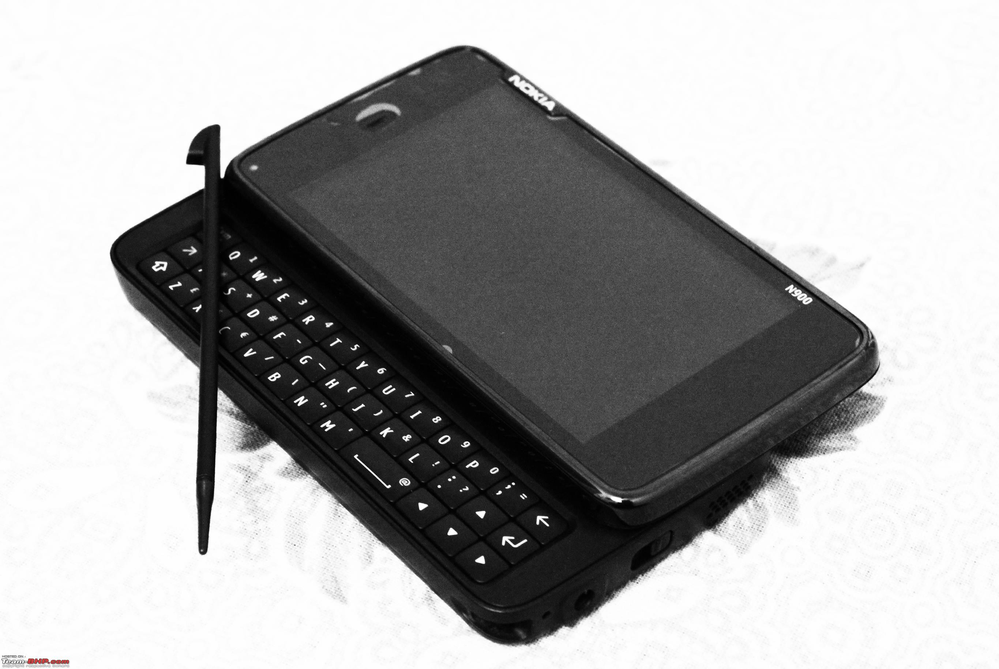
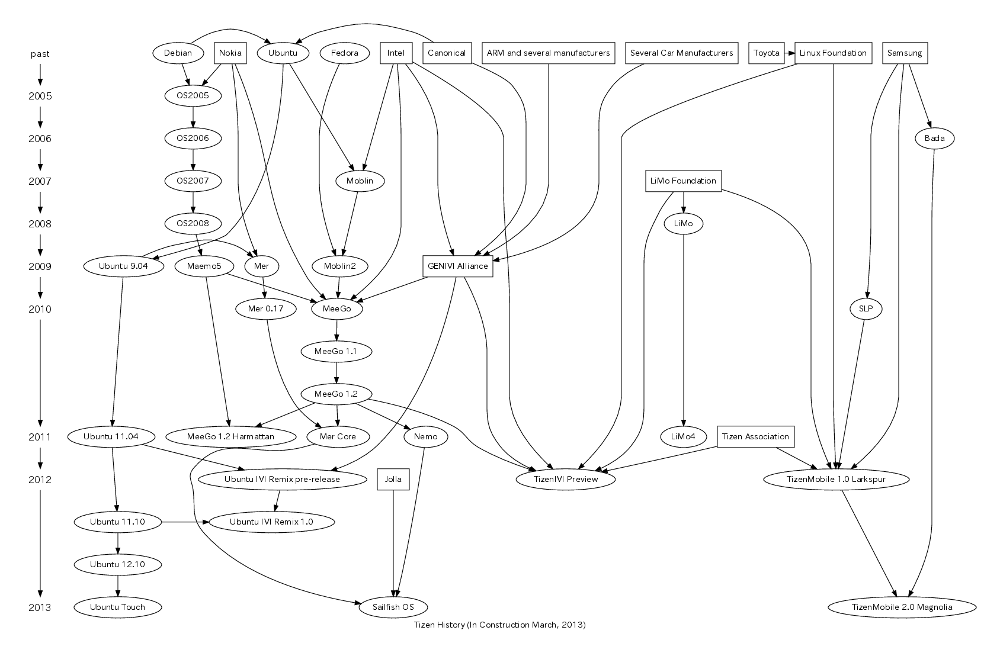

## n900 notes



## Table of Contents
* [Preface](#preface)
* [Initial Research](#initial-research)
* [Flashing Firmware](#flashing-firmware)
  * [Required Data Files](#required-data-files)
  * [Flashing Tool](#flashing-tool)
    * [Usage](#usage)
* [Resources](#resources)
  * [Repositories](#repositories)
* [Debugging](#debugging)
  * [Status Lights](#status-lights)
* [References](#references)
  * [Experiences](#experiences)
  * [Maemo](#maemo)
  * [Cool Projects](#cool-projects)

### Preface

A coworker recently mentioned a project to me. He couldn't think of the name but described it as a "reboot of an old phone with a kickout keyboard that runs Linux". I instantly new he was talking about the n900, and we figured out [neo900](http://neo900.org/) was the aformentioned project. I read up on the project and thought it was a bit of an investment for a phone I'm not sure I'd like. The only reason I knew about the n900 was because a friend in college used one and showed me a lot of cool things on it, but I never owned one myself.

So I bought an n900 on eBay in 2016. Not to replace my current phone but to have what I find to be an impressive mobile Linux device that fits in my pocket.

What lies ahead consists of my research to modernize the software on the device amongst a sea of dead links in a niche community.


### Initial Research

First things first, eventhough the phone came with Maemo 5, **I want to wipe the device and start fresh**

This process also entailed trying to understand the past five years of the ecosystem around the n900.

The chart below is a diagram of Tizen's history, you can see Maemo 5 in the middle left, starting from the Debian root.




### Flashing Firmware

#### Required Data Files

eMMC (VANILLA) & FIASCO (COMBINED)

> (flashing the) eMMC aka *VANILLA*, which will replace the complete content of N900’s internal 32 GB storage (embedded MMC), which is: the /home partition which has your stored browser passwords and game highscores and calendar and contacts etc. /home is also containing /opt. Plus eMMC stores all the content of the MyDocs 28 GB VFAT partition, where all the media and docs and other user content lives.

> (flashing the) FIASCO aka *COMBINED*, also referred to as “rootfs” though this file and flashing process also consists of / affects NOLO bootloader (the several stages), the kernel, and usually the GSM modem firmware, in addition to the root filesystem which is basically the content of your 240 MB NAND flash storage and implements the Linux operating system.

[As written by mynokian900.com](http://www.mynokian900.com/2011/03/flashing-the-emmc-rootfs-on-my-nokia-n900)


Grab the latest eMMC and FIASCO bins:

[Mirror of tablets-dev.nokia.com restricted downloads](http://www.fladnag.net/downloads/telephone/n900/)


```
5b3ed76fee820f5adb48295eae7fe093  LICENSE
488809ff96a0a05479d692e9f77aeb4f  RX-51_2009SE_10.2010.13-2.VANILLA_PR_EMMC_MR0_ARM.bin
b9f8690318a3be61767826d15b8c1784  RX-51_2009SE_20.2010.36-2_PR_COMBINED_MR0_ARM.bin
```

#### Flashing Tool

[Flasher-3.5](http://wiki.maemo.org/Documentation/Maemo_5_Developer_Guide/Development_Environment/Maemo_Flasher-3.5)

*TODO: add links to mirrors*

##### Usage

*TODO*

### Resources

#### Repositories

```
extras
extras-devel
extras-testing

If you are looking for nokia / ovi repos...
that is another matter.

I would suggest disabling your existing repos.
and enabling the repos from http://www.maemo-repos.com
which have ALL the repos.
```
[Source](http://talk.maemo.org/showpost.php?p=1497359&postcount=2)


### Debugging

##### Status Lights

```
What do the Nokia N900 LED colors mean?

1. Blue color (blinking): Incoming message (instant message or SMS message or email) or missed call
2. Orange color (blinking): Battery is Charging
3. Green color: Battery is fully charged
4. White (blinking): Stand-by
5. Red color (blinking): Error
6. Yellow: Device soft on/off
7. White (fade in): Power on
8. White (fade out): Power off
9. Red (blink once): Webcam on
```
[source](http://n900tips.blogspot.com/2010/04/what-do-nokia-n900-led-colors-mean.html)

[Custom Status Lights (Advanced)](https://wiki.maemo.org/LED_patterns)


### References

#### Experiences
* [Another recent adopter who went through the process](http://blog.tldnr.org/english/2015/01/10/reviving-an-old-n900-without-lock-code/)

#### Maemo
* [maemo forums](http://talk.maemo.org)
* [maemo development wiki](http://maemo.org/development/)

#### Cool projects
* [QUAD BOOT](http://talk.maemo.org/showthread.php?t=74956)

